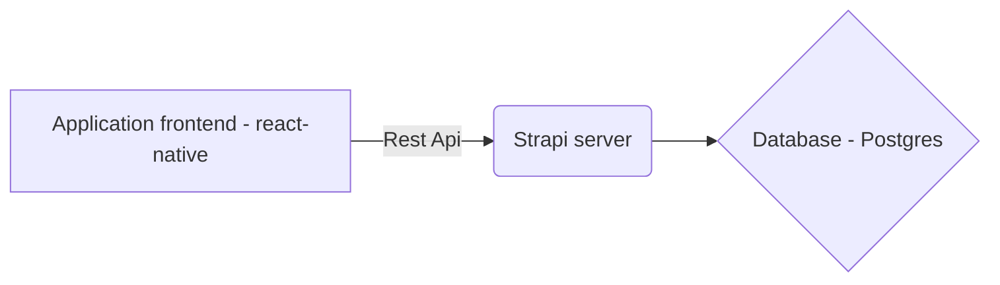

# TRNR (Documentation)

## Code repositories
1. [React Native](https://github.com/visheshdubey/trnr-react-native)
2. [Strapi Backend](https://github.com/visheshdubey/trnr-app-backend) , URL :- [admin link](app.trnr.com/admin)

## Project Architecture

Following is the client-server architecture.

##  Developer Notes
 - ###  How to backup database?
Login to the server using server key, enter the command :- 
`pg_dump -U appdbUser -W -d strapi > backup_<DATE OF BACKUP>.sql`
 after above step, enter db password to generate backup.

 - ### How to push react-native code to production?
	 - #### Android
		 - To build the project :  `eas build --platform android --profile production`
		 - To Submit the build : `eas submit -p android --latest --profile production`
	 - #### iOS
		 - To build the project :  `eas build --platform ios --profile production`
		 - To Submit the build : `eas submit -p ios --latest --profile production`
		 - Local testing : `eas build --platform ios --profile production --local`
 - ### How to push strapi to production?
	 - Navigate to trnr-application-backend dir
	 - `git pull`
	 - `cd ..`
	 - `pm2 restart ecosystem.config.js`
	 - #### Points to remember :-
		 - Make sure `config\middleware.js` and `config\plugins.js` are in production format while deploying.
## Current issues

 - expo-screen-orientation is not working for unlockAsync(). for this reason we have remove `orientation:"portrait"` from app.json . This will work fine in iOS. In android we have to add this code. Before every deployment/update we have to do this manually.
 - Video can be played simultaneously in two tabs. 

 

